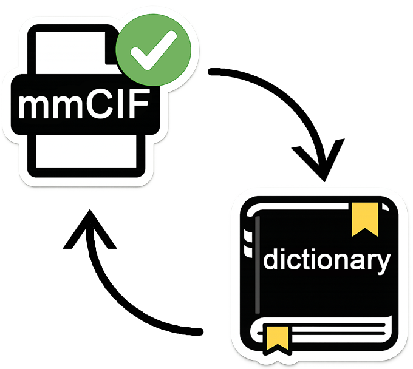
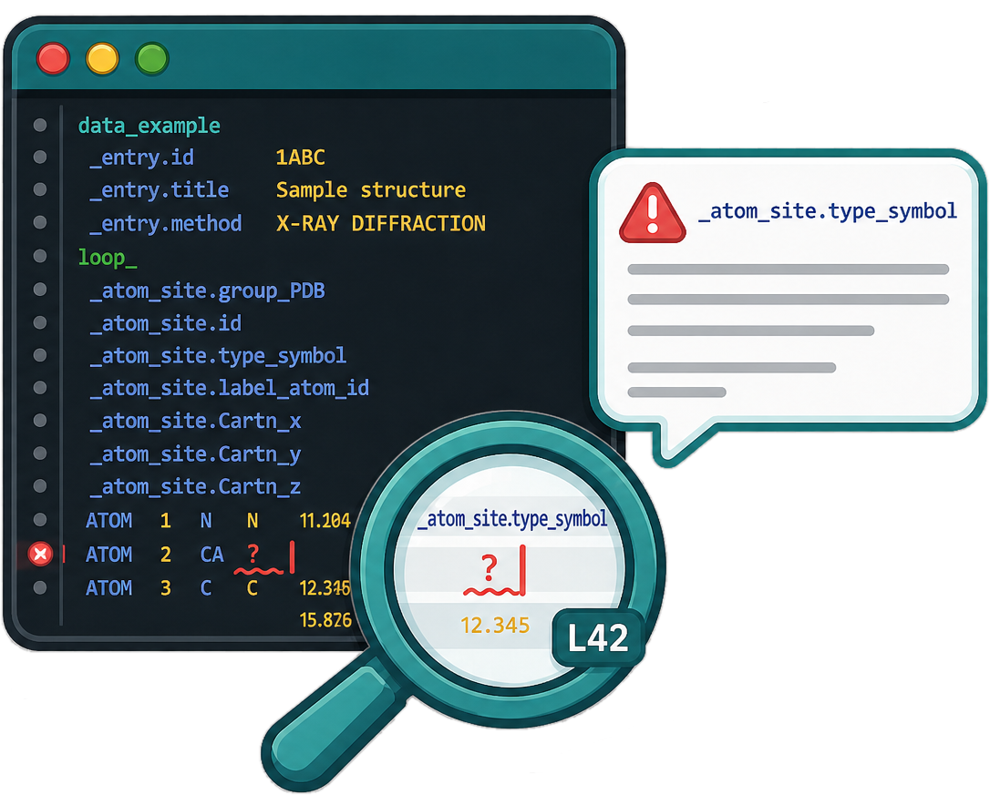

# PDBe mmCIF Validator



**Version 0.1.92**

Real-time VS Code extension, standalone Python tool, and online validator for mmCIF/CIF files.

- [](https://pypi.org/project/pdbe-mmcif-validator/)
- [](https://marketplace.visualstudio.com/items?itemName=PDBEurope.pdbe-mmcif-validator)
- [](https://open-vsx.org/extension/PDBEurope/pdbe-mmcif-validator)
- [](https://www.youtube.com/watch?v=CCkC9Bc6FY8)
- [](https://www.youtube.com/watch?v=li7ETeSA8FI)
- [GitHub Releases](https://github.com/PDBeurope/mmcif-validator/releases)
- [Extension documentation](vscode-extension/README.md)
- [Python script documentation](vscode-extension/python-script/README.md)

<p align="center">
  <strong>====&gt; <a href="https://wwwdev.ebi.ac.uk/pdbe/mmcif-validator/">Try this online</a> &lt;====</strong>
</p>

## Table of contents

- [Overview](#overview)
- [Features](#features)
- [Quick start](#quick-start)
- [Requirements](#requirements)
- [Documentation](#documentation)
- [What's new](#whats-new)
- [Releases](#releases)
- [Contributing](#contributing)
- [Acknowledgments](#acknowledgments)
- [License](#license)

## Overview

The PDBe mmCIF Validator provides comprehensive validation of mmCIF files against CIF dictionaries, available in three ways:

- **Visual Studio Code extension** — real-time validation with error highlighting as you edit ([Marketplace](https://marketplace.visualstudio.com/items?itemName=PDBEurope.pdbe-mmcif-validator) · [Open VSX](https://open-vsx.org/extension/PDBEurope/pdbe-mmcif-validator))
- **Standalone Python script / PyPI package** — command-line tool and library for batch processing and CI/CD ([PyPI](https://pypi.org/project/pdbe-mmcif-validator/))
- **Online validator (under development)** — try it in the browser at [wwwdev.ebi.ac.uk/pdbe/mmcif-validator](https://wwwdev.ebi.ac.uk/pdbe/mmcif-validator/)

All implementations share the same validation engine, ensuring consistent results across different usage scenarios.

[](https://www.youtube.com/watch?v=CCkC9Bc6FY8)

## Features

### Validation


- **Dictionary flexibility** — Works with PDBx/mmCIF dictionary or any CIF dictionary format
- **Works out-of-the-box** — No configuration required (uses default dictionary URL)
- **No dependencies** — Python script uses only standard library

The validator performs comprehensive checks including:

- Item definition validation
- Mandatory item presence (category-aware)
- Enumeration value validation
- Data type validation (including regex patterns from dictionary)
- Range constraints (strictly allowed vs advisory)
- Parent/child category relationships
- Foreign key integrity
- Composite key validation
- Complex operation expression parsing
- Duplicate category and item detection (loop and frame format)

For detailed information about all validation checks and error severity levels, see [Validation Checks](vscode-extension/python-script/README.md#validation-checks) in the Python script README. For VS Code configuration options, see [Configuration](vscode-extension/README.md#configuration).

<br clear="all">

### Metadata completeness


The **metadata completeness** score (0–100%) reflects missing categories and items against method-aware mandatory lists (X-ray / EM / NMR from bundled lists), including an entity-source group where any one of several categories is sufficient, and deposition-mandatory items from the dictionary. Available in the VS Code extension (Status bar and **Metadata Completeness** view in the Explorer sidebar) and in JSON output from the Python script. Missing categories and items (including row-level missing or invalid values) are listed in the sidebar and Output channel; validation errors count as not filled. If the experimental method cannot be determined from the file, only common categories are used and the score is capped at 50%.

[](https://www.youtube.com/watch?v=li7ETeSA8FI)

<br clear="all">

### Editor integration


- **Real-time validation** — Automatically validates mmCIF/CIF files as you edit (VS Code extension)
- **Error highlighting** — Errors and warnings highlighted directly in the editor with precise character positioning
- **Syntax highlighting** — Full syntax highlighting for CIF files
- **Hover information** — Hover over values to see corresponding tags and data blocks
- **Configurable validation timeout** — Increase timeout for very large files (extension setting, default 60s, max 10 min)

<br clear="all">

## Quick start

### Try online

Open the [online validator](https://wwwdev.ebi.ac.uk/pdbe/mmcif-validator/) (under development) and upload or paste a mmCIF/CIF file — no install required.

### VS Code extension

Install from the [VS Code Marketplace](https://marketplace.visualstudio.com/items?itemName=PDBEurope.pdbe-mmcif-validator) or [Open VSX](https://open-vsx.org/extension/PDBEurope/pdbe-mmcif-validator), then open any `.cif` file. The extension works out-of-the-box and automatically downloads the PDBx/mmCIF dictionary. See the [extension README](vscode-extension/README.md) for detailed documentation.

### Standalone Python script

```bash
pip install pdbe-mmcif-validator
validate-mmcif --url http://mmcif.pdb.org/dictionaries/ascii/mmcif_pdbx.dic model.cif
```

Or run from a clone:

```bash
python vscode-extension/python-script/validate_mmcif.py --url http://mmcif.pdb.org/dictionaries/ascii/mmcif_pdbx.dic model.cif
python vscode-extension/python-script/validate_mmcif.py --file mmcif_pdbx.dic model.cif
```

See the [Python script README](vscode-extension/python-script/README.md) for detailed usage and library API.

## Requirements

- **Python 3.7 or higher** — Required for the extension and standalone script
- **Internet connection** (optional) — Only needed if using the default dictionary URL or the online validator

## Documentation

- **[Extension Documentation](vscode-extension/README.md)** — Complete guide for VS Code extension users
- **[Python Script Documentation](vscode-extension/python-script/README.md)** — Command-line usage and API details
- **[Testing Suite](testing/README.md)** — Regression test suite (run validator on CIFs, diff against baseline)
- **[Cross-check Rules Catalog](docs/cross_check_rules_catalog.txt)** — Generated catalog of grouped cross-check rules

## What's new

See the full [CHANGELOG](vscode-extension/CHANGELOG.md).

Release **0.1.92** documents and automates the cross-check rules catalog workflow (`tools/generate_cross_check_rules_catalog.py`), including guidance to regenerate the catalog whenever `rules/data/cross_checks_*.json` changes.

Release **0.1.91** adds JSON-first procedural cross-checks, pairwise date-order and within-category uniqueness cross-checks, quoted-empty loop parsing, dictionary-enum and selector-gated cross-reference runtime coverage, and related cross-check refinements. Release **0.1.9** introduced the scalable grouped JSON rule framework (rule engine, shared utilities, toggles).

## Releases

Pre-built VS Code extension packages (`.vsix`) are published on the [GitHub Releases](https://github.com/PDBeurope/mmcif-validator/releases) page. To install a specific version, download the `.vsix` from the desired release and install it via **Extensions → ⋯ → Install from VSIX...**.

Releases are created from git tags (e.g. `v0.1.92`). Pushing a version tag triggers a GitHub Action that builds the extension and attaches the `.vsix` to the corresponding release.

## Contributing

Contributions are welcome! Please feel free to submit issues or pull requests.

## Acknowledgments

This extension includes syntax highlighting and hover functionality based on work by Heikki Kainulainen (hmkainul) from the [vscode-cif extension](https://github.com/hmkainul/vscode-cif). Used under MIT License.

## License

MIT

## Author

Deborah Harrus, Protein Data Bank in Europe (PDBe), EMBL-EBI
